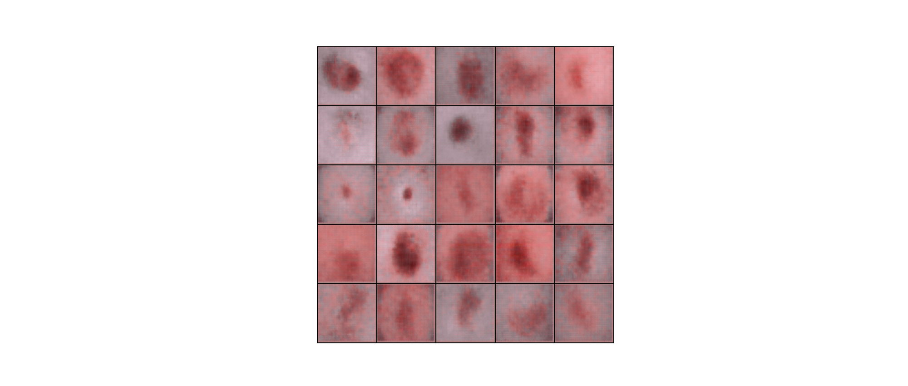

# Generative Models for medical data augmentation



Run these lines to set up a working environment in terminal:
```bash
conda create -n gan
conda activate gan
conda install python==3.10.0
pip install -r requirements.txt
```
To download the dataset visit [this page][https://www.kaggle.com/datasets/kmader/skin-cancer-mnist-ham10000?resource=download]

